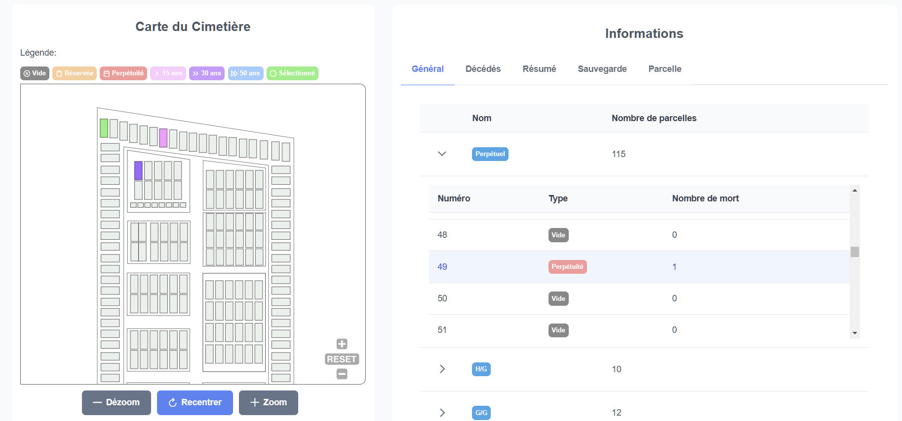

# 🪦 Range tes morts - Bring out your dead 🪦

`🪦 Range tes morts` is a simple tool to help manage all the deads in a cemetery.

Draw the cemetery map as a SVG, edit the SVG with Python scripts to make it usable, populate the database with Go CLI, and serve the data with a Go server.
Visualize the data with a higly interactive Angular client offering you an interactive map of the cemetery with a lot of features.

Create your own cemetery map, change the SVG file, and everything will work.

**🐳 Docker Supported**



## Table of contents

- [🪦 Range tes morts - Bring out your dead 🪦](#-range-tes-morts---bring-out-your-dead-)
  - [Table of contents](#table-of-contents)
  - [Technologies](#technologies)
  - [Installation](#installation)
    - [Create the SVG file](#create-the-svg-file)
    - [Docker](#docker)
    - [Manual installation](#manual-installation)
      - [Backend](#backend)
      - [Frontend](#frontend)
  - [Usage](#usage)
    - [Backend CLI](#backend-cli)
      - [Populate the database](#populate-the-database)
      - [Excel Backup](#excel-backup)
      - [List the users](#list-the-users)
      - [Add a user](#add-a-user)
      - [Remove a user](#remove-a-user)
  - [License](#license)
  - [Changelog](#changelog)
  - [Improvements](#improvements)

## Technologies

| Name    | Description                                                                      | Version |
| ------- | -------------------------------------------------------------------------------- | ------- |
| Python  | Python is used to generate and modify the SVG file representing the cemetery.    | 3.12    |
| Go      | Go is used as a CLI for the server, and serve the data to the client.            | 1.13    |
| Node    | Node is used to serve the client.                                                | 21.7    |
| Angular | Angular is used to visualize the cemetery data with a highly interactive client. | 19.0    |

The database is a simple SQLite database that is created and populated by the Go Server/CLI.

All the documentation related to the database can be found in the [database](database) folder. (MCD, MLD, SQL)

## Installation

### Create the SVG file

You must create a SVG file with the following structure:

```xml
<svg>
    <g id="Graveyard">
        <g id="LOT_NAME">
          <rect id="LOT_NAME#ID" />
          <rect id="LOT_NAME#ID" />
          <rect id="LOT_NAME#ID" />
        </g>
    </g>
</svg>
```

The main grave frame is a `g` element with the id `Graveyard`.
Inside the Graveyard element, you can have multiple `g` elements representing the lots. Each lot is a `g` element with the `id` attribute. The `id` attribute must be the name of the lot.

Each grave is a `rect` element with an `id` attribute. The `id` attribute must be in the following format: `LOT_NAME#ID`. The `LOT_NAME` is the name of the lot, and the `ID` is the identifier of the grave in the lot.

A `rect` with the id `PATH` is excluded as a grave and represents the outline of the lot.

---

First, you need to create the SVG file representing the cemetery. You can use any software to create the SVG file. I've used [Inkscape](https://inkscape.org/) to create the SVG file. You can find the SVG files in the `scripts` folder.
You must give a name to every element and order them as described above.

At this point each element does not have an id.
The first **Python script** `scripts/convertInkLabelsToId.py` will convert the labels to ids.

A second **Python script** `scripts/writeNumbersOnMap.py` will write the identifiers on the graves.

The SVG is now ready to be used.

It needs to be placed in the `frontend/public` folder in order to be displayed by the client.
And also in the `backend/static` folder in order to automatically populate the database with the help of the CLI.

### Docker

First pull the project from the repository:

```bash
git clone https://github.com/Eric-Philippe/Range-tes-morts.git
```

Then create your own .env file in the root of the project:

```bash
cp .env.example .env
```

Then build the project with Docker:

```bash
docker-compose up --build
```

### Manual installation

#### Backend

First, you need to install the Go dependencies:

```bash
go mod download
```

Then you can build the project:

```bash
go build -o range-tes-morts
```

#### Frontend

First, you need to install the Node dependencies:

```bash
npm install
```

Then you can build the project:

```bash
npm run build
```

Or you can serve the project if you have the Angular CLI installed:

```bash
ng serve
```

## Usage

### Backend CLI

The backend CLI is used to make an interface between the database and the user. You can either run them from the `main.go` file or use the compiled binary in the docker container.

#### Populate the database

> You must have the SVG file in the `backend/static` folder.

```bash
./main --migrate
```

This command will create the database and populate it with the graves from the SVG file.

#### Excel Backup

```bash
./main --backup
```

This command will create an Excel file with the data from the database.

#### List the users

```bash
./main --listusers
```

This command will list all the users in the database.

#### Add a user

```bash
./main --newuser -u username -p password
```

This command will add a new user to the database with a hashed password.

#### Remove a user

```bash
./main --delete -u username
```

This command will remove a user from the database.

## License

This project is licensed under the MIT License - see the [LICENSE](LICENSE) file for details.

## Changelog

You can find the changelog in the [CHANGELOG.md](CHANGELOG.md) file.

## Improvements

- [ ] Make a complete CLI in Python to manipulate SVG files.
- [ ] Add a log feature to log every action made by the users.
- [ ] Migrate the Excel file to the database.
